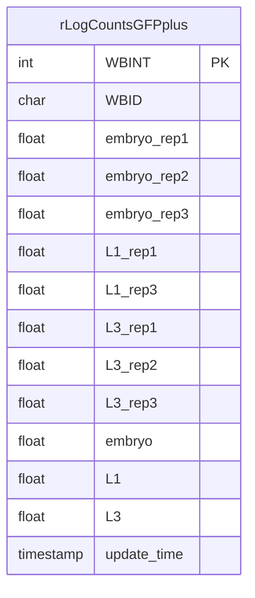

```mermaid
erDiagram
rLogCountsGFPplus {
int WBINT PK
char WBID 
float embryo_rep1 
float embryo_rep2 
float embryo_rep3 
float L1_rep1 
float L1_rep3 
float L3_rep1 
float L3_rep2 
float L3_rep3 
float embryo 
float L1 
float L3 
timestamp update_time 
}
```

```mermaid
erDiagram


`I_TF` {

int ID PK 

}
```
