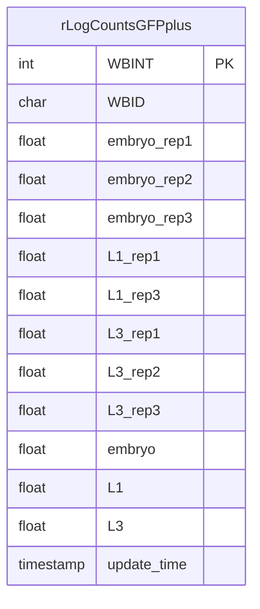

```mermaid
erDiagram
`I_TF` {
int WBINT PK
char WBID 
float embryo_rep1 
float embryo_rep2 
float embryo_rep3 
float L1_rep1 
float L1_rep3 
float L3_rep1 
float L3_rep2 
float L3_rep3 
float embryo 
float L1 
float L3 
timestamp update_time 
}

```mermaid
erDiagram


rawCounts_L1 {
int L1_whole_rep1
int L1_cells_rep1
int L1_GFPplus_rep1
int L1_GFPminus_rep1
int L1_whole_rep2
int L1_cells_rep2
int L1_GFPplus_rep2
int L1_GFPminus_rep2
int L1_whole_rep3
int L1_cells_rep3
int L1_GFPplus_rep3
int L1_GFPminus_rep3
}
```
