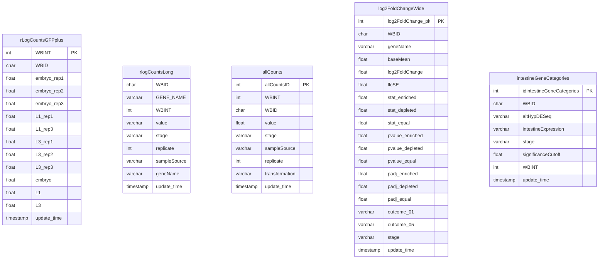
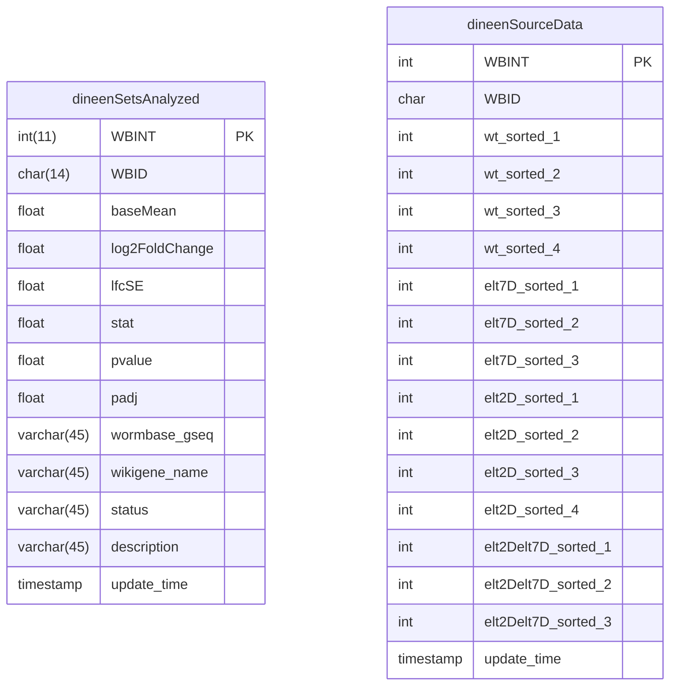
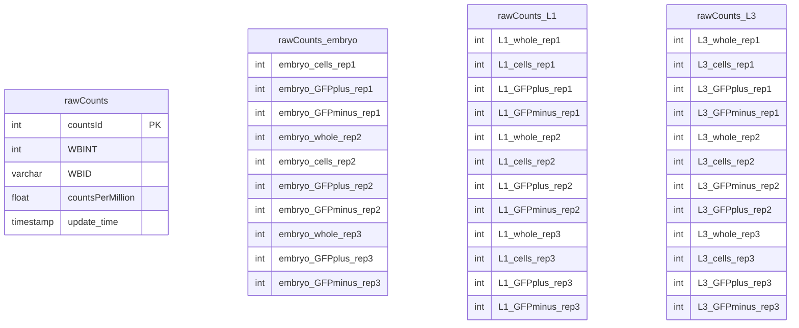
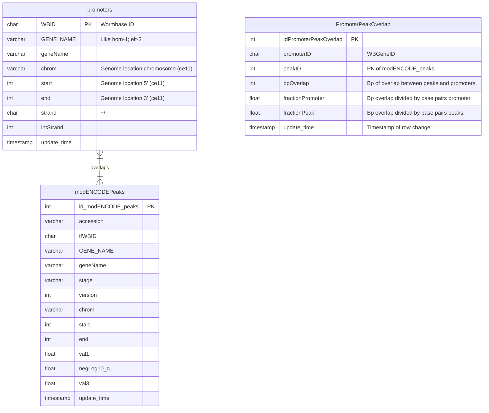
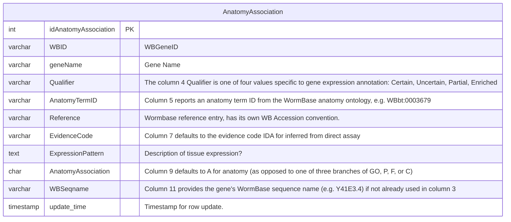
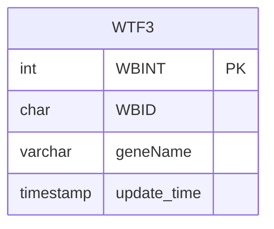

# design 
## williams 2023

Data from or derived Williams et al., 2023.

### Most tables of interest

### Data from Dineen et al., that Rob reanalyzed

### Rob's raw data

All one table (rawCounts). The displayed '_stage' labels are for the graph display only. Need to check up on embryo rep1 whole and rep3 cells.

### NishimuraLab

#### modENCODE/modERN

#### Tables from WormBase

#### Other tables

