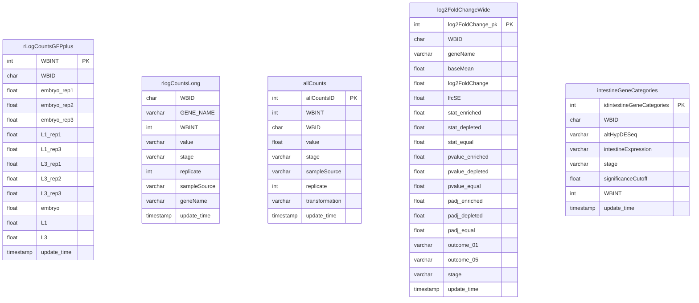
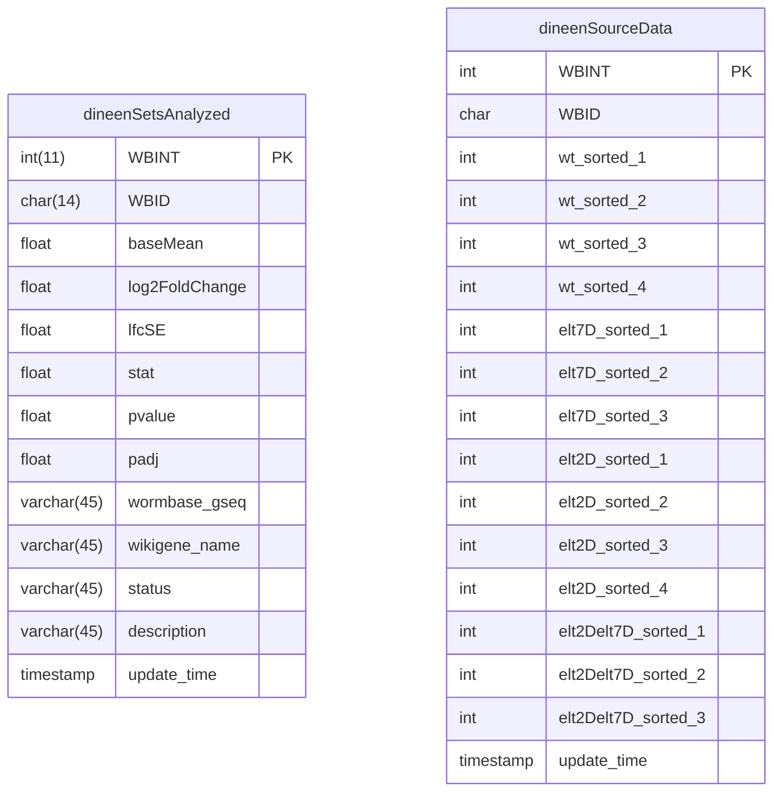
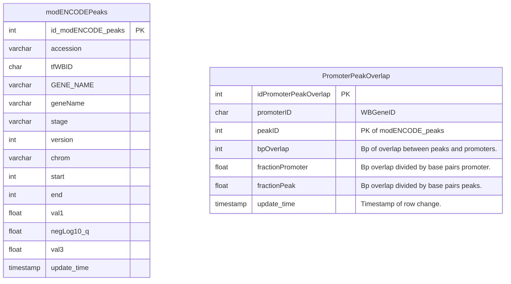
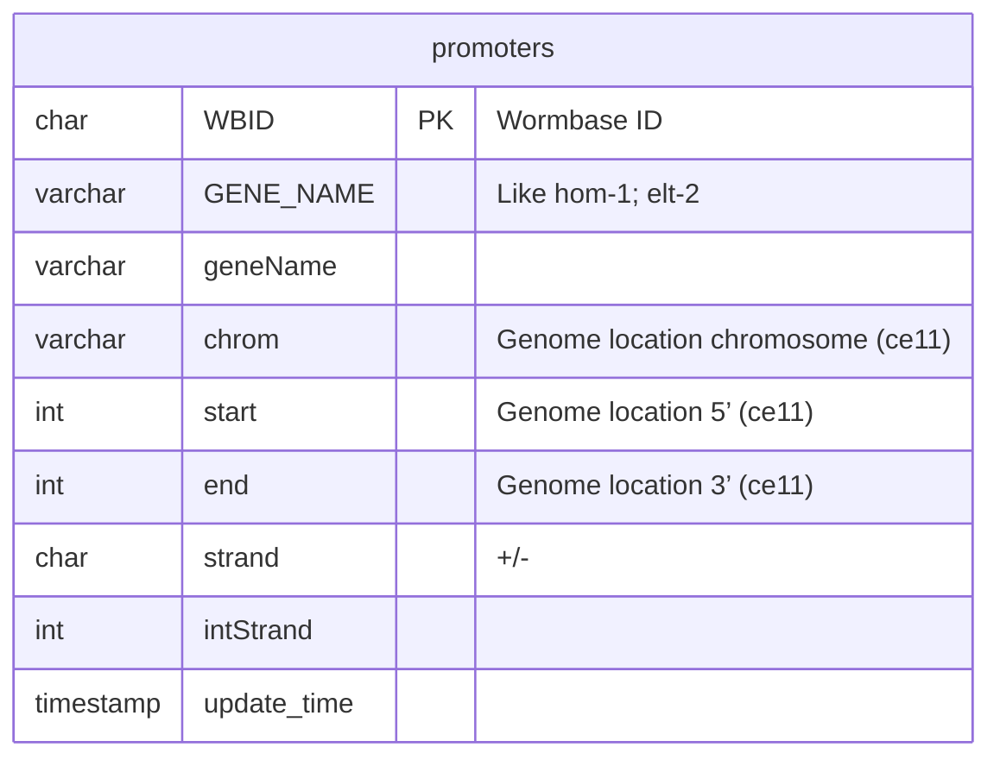
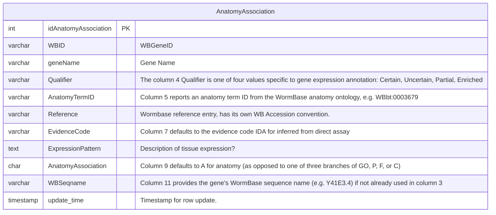
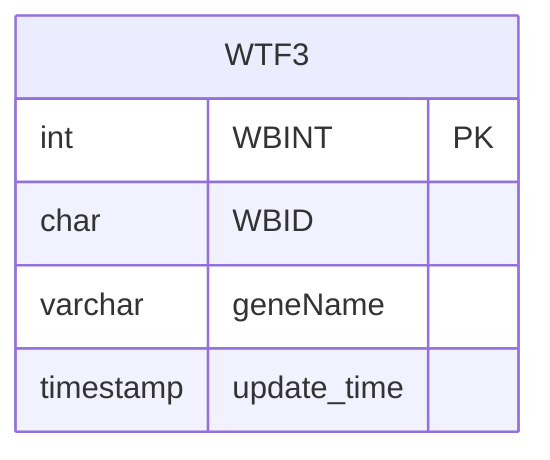

# OnishRDB

Osborne Nishimura R Database interface

## Requirements

Libraries R.cache, RMariaDb, dplyr.

``` r
if (! require(R.cache)) {
  install.packages('R.cache')
  library(R.cache)
}
if (! require(RMariaDB)) {
  install.packages('RMariaDB')
  library(RMariaDB)
}
if (! require(dplyr)) {
  install.packages('dplyr')
  library(dplyr)
}
```

## Usage

Simply source the script accompanying the data object you want to import.

### DBPeakOverlaps

DBPeakOverlaps.R defines an object DBPeakOverlaps by aggregating a table of peak/promoter intersections. The data are cached using `R.cache`, so sourcing the file again will just load the data from a cache location.

```
> source('DBPeakOverlaps.R')
loading ac3be2fcc75ebff443aa858f2722233c.Rcache 
total cache size: 58M	/Users/david/Library/Caches/org.R-project.R/R/R.cache
Loading DBPeakOverlaps from cache
# A tibble: 10 × 10
# Groups:   name [10]
   name    `alr-1_L1_1` blmp-1_L1_…¹ ceh-1…² ceh-2…³ ceh-3…⁴ ces-1…⁵ cnd-1…⁶ daf-1…⁷ dpl-1…⁸
   <chr>          <int>        <int>   <int>   <int>   <int>   <int>   <int>   <int>   <int>
 1 2L52.1             1            2       1       1       1       3       1       2       1
 2 AC3.5              0            2       0       0       0       0       0       0       0
 3 AC7.3              0            0       0       0       0       1       0       0       0
 4 AH10.4             0            0       0       0       0       0       0       0       0
 5 AH9.3              0            0       0       0       0       0       0       0       0
 6 AH9.6              0            0       0       0       0       1       0       0       0
 7 B0001.3            0            1       0       0       0       0       0       0       0
 8 B0001.4            0            0       0       0       0       0       0       0       0
 9 B0001.7            0            0       0       0       0       0       0       0       0
10 B0019.2            0            0       0       0       1       0       0       0       1
# … with abbreviated variable names ¹​`blmp-1_L1_1`, ²​`ceh-13_EE_1`, ³​`ceh-28_L3_1`,
#   ⁴​`ceh-31_LE_1`, ⁵​`ces-1_EM_1`, ⁶​`cnd-1_EM_1`, ⁷​`daf-16_L4_1`, ⁸​`dpl-1_L1_1`
```
The above output is given by the script itself. 

The following code confirms the creation of the object in your environment, and calls `dim()` on it.
```
> "DBPeakOverlaps" %in% ls()
[1] TRUE
> dim(DBPeakOverlaps)
[1] 13703   474
```

## Messages from Caching

### DBPeakOverlaps

DBPeakOverlaps has two cached objects: the database table and the aggregated tibble. If the tibble is missing from the cache, it will be recalculated.

```
> source("~/work/OnishRDB/DBPeakOverlaps.R")
DBPeakOverlaps not cached... Checking for cached table from DB.
loading be06092e7cfaa4ac714843997bf2d474.Rcache 
total cache size: 32M	/Users/david/Library/Caches/org.R-project.R/R/R.cache
combining overlaps...`summarise()` has grouped output by 'name'. You can override using the `.groups` argument.
 58M	/Users/david/Library/Caches/org.R-project.R/R/R.cache
# A tibble: 10 × 10
# Groups:   name [10]
```

If both the tibble and the database table are missing, the query will be made to download the table.


# Database design

## williams 2023


Data from or derived Williams et al., 2023.

### Most tables of interest



### Data from Dineen et al., that Rob reanalyzed



### Rob's raw data

```mermaid
erDiagram

rawCounts {
int countsId PK
int WBINT
varchar WBID
int embryo_cells_rep1
int embryo_GFPplus_rep1
int embryo_GFPminus_rep1
int embryo_whole_rep2
int embryo_cells_rep2
int embryo_GFPplus_rep2
int embryo_GFPminus_rep2
int embryo_whole_rep3
int embryo_GFPplus_rep3
int embryo_GFPminus_rep3
}

rawCounts(continued1) {
int L1_whole_rep1
int L1_cells_rep1
int L1_GFPplus_rep1
int L1_GFPminus_rep1
int L1_whole_rep2
int L1_cells_rep2
int L1_GFPplus_rep2
int L1_GFPminus_rep2
int L1_whole_rep3
int L1_cells_rep3
int L1_GFPplus_rep3
int L1_GFPminus_rep3

rawCounts(continued2) {
int L3_whole_rep1
int L3_cells_rep1
int L3_GFPplus_rep1
int L3_GFPminus_rep1
int L3_whole_rep2
int L3_cells_rep2
int L3_GFPminus_rep2
int L3_GFPplus_rep2
int L3_whole_rep3
int L3_cells_rep3
int L3_GFPplus_rep3
int L3_GFPminus_rep3
float countsPerMillion
timestamp update_time
}
```


### NishimuraLab

#### modENCODE/modERN





#### Tables from WormBase



#### Other tables


